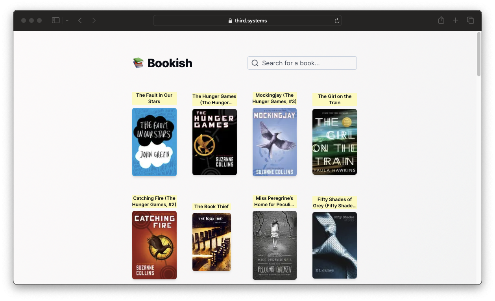

# 📚 Bookish

**Bookish** is _semantic search engine_ finds books based on the semantic meaning of your query. It contains over 9,000 books.

## About

This prototype shows how we can use LLMs in ways besides just chatbots to help us find content more directly related to the meaning of what we're looking for. Traditional keyword search engines generally attempts to find information by looking for content that fits the keywords in the query. This is a proof-of-concept rather than a finished product. 

## How it works
1. Took a sample set of book descriptions and user reviews of those books
  * Chunked up the descriptions and reviews based on certain characters (Langchain)
  * Embedded them using the [GTE-small](https://huggingface.co/Supabase/gte-small) model
  * Stored the vectors in a Postgres database using pgvector
2. User queries are embedded yielding a vector
3. The nearest neighbors are computed using cosine similarity and returned back to the user
